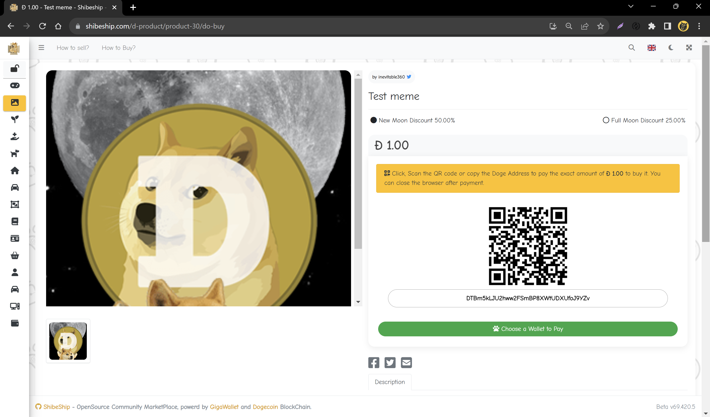
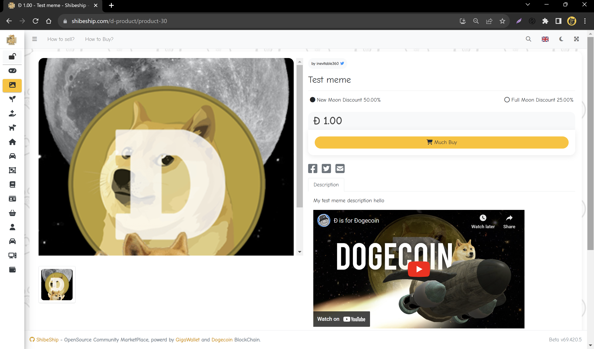
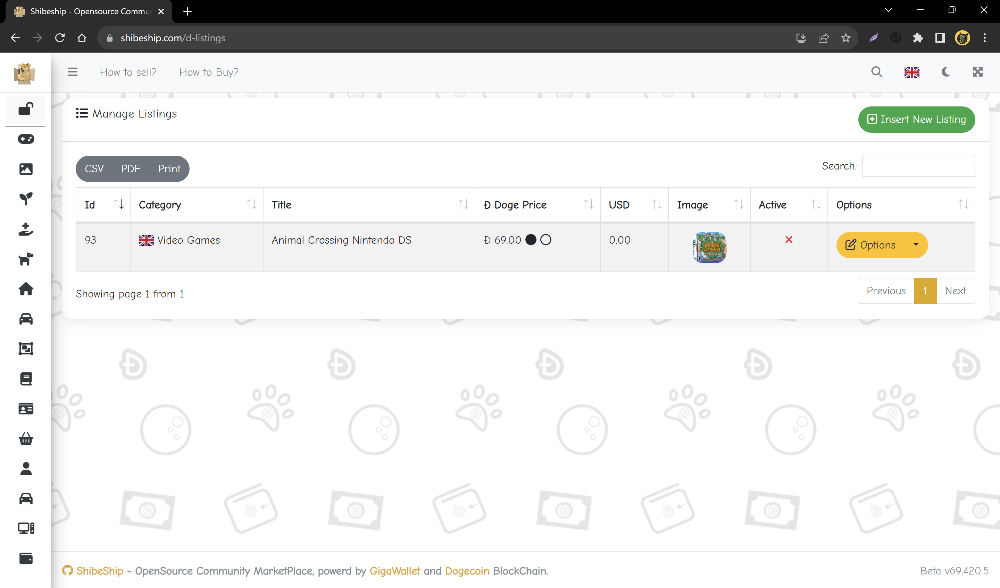
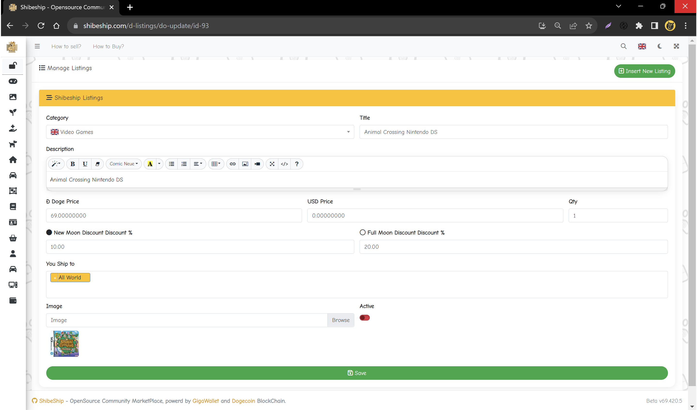
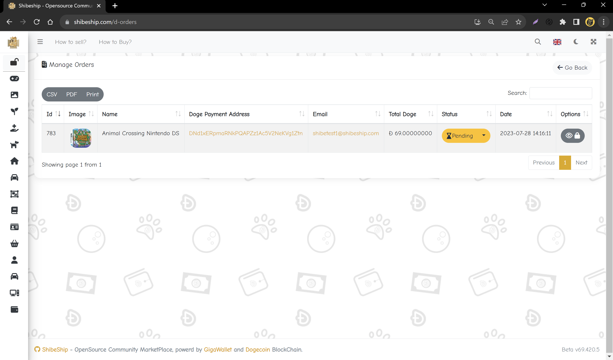
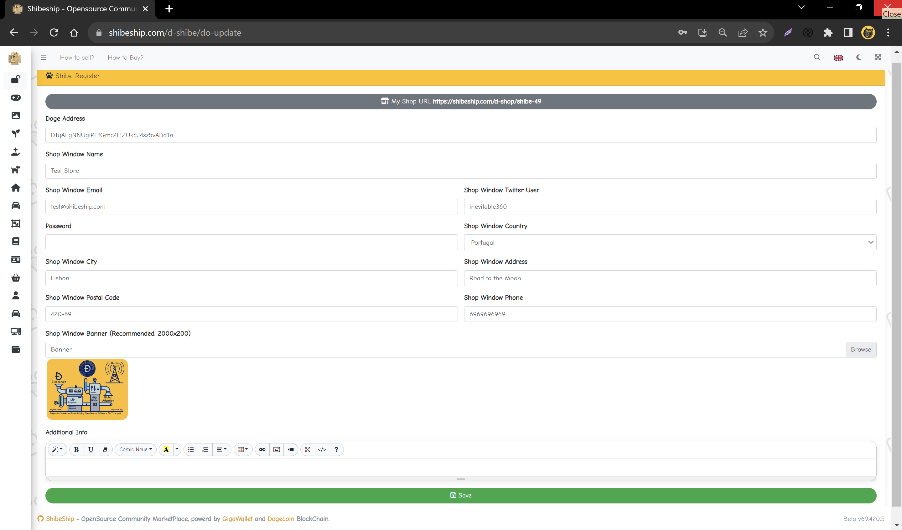

# What is ShibeShip?

Its a Dogecoin Opensource Marketplace like CraigList or eBay, powered by [GigaWallet](https://github.com/dogecoinfoundation/gigawallet), that anyone can buy and sell any products or services using only Doge as a means of exchange AKA a currency.

> ⚠️ Note: ShibeShip it's still in beta

