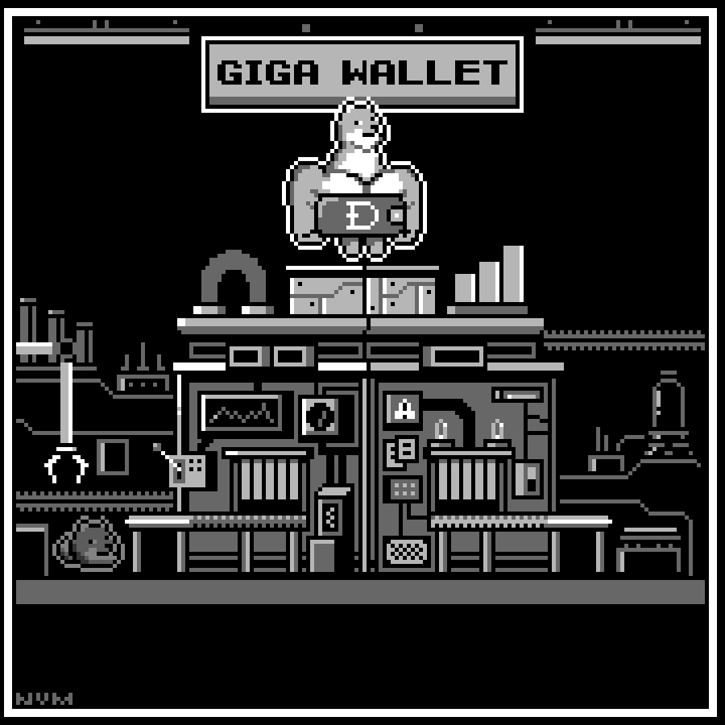

# What is GigaWallet?

Dogecoin GigaWallet is a backend service which provides a convenient integration API 
for platforms such as online shops, exchanges, social media platforms etc, to accept 
and transact Dogecoin on behalf of their users.

The purpose of the GigaWallet is to promote the rapid uptake of Dogecoin as a payment 
option, by taking the complexity and risk out of integrating Dogecoin payments into 
business.

## It's dangerous to go alone, take this? Maybe! 

> ⚠️ Note: GigaWallet is a software-engineering component for anyone looking to 
> integrate Dogecoin into their product, this is not a user-facing Dogecoin wallet.
> If you are a user looking for a dogecoin wallet you can search the [wallet index](https://dogecoin.com/wallets/) 
> on the [dogecoin.com](https://dogecoin.com) website. 

It is expected that you are a comfortable with managing server infrastructure and 
integrating with REST APIs. GigaWallet is a service that _must_ be deployed behind a 
firewall that protects it's sensitive APIs from the public internet, to which you 
will integrate your public-facing systems.  

Effort has been taken to create a system which integrates with _your platform_, and
so the APIs for Accounts all require a _foreignID_ which represents the account from
your system. 

GigaWallet manages it's own database to track HD wallets, Invoices, 
UTXOs and other data it needs, however it is not a general-purpose shopping cart 
or user management system, it is expected that you will provide what you need on 
your side to create the magic ✨ you have in mind, good luck adventurer!

